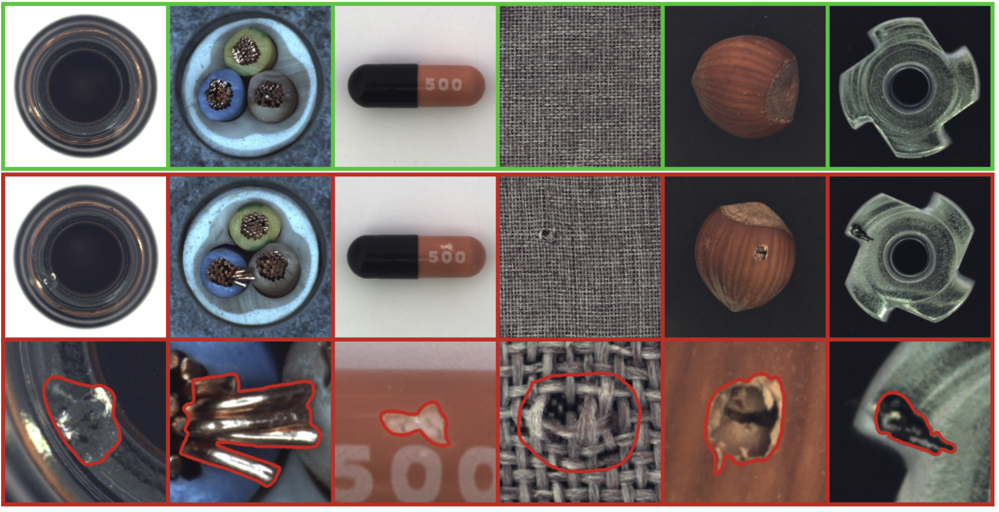
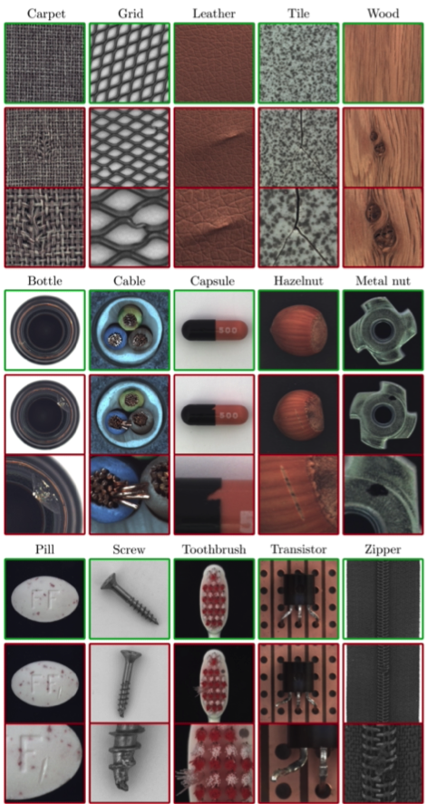
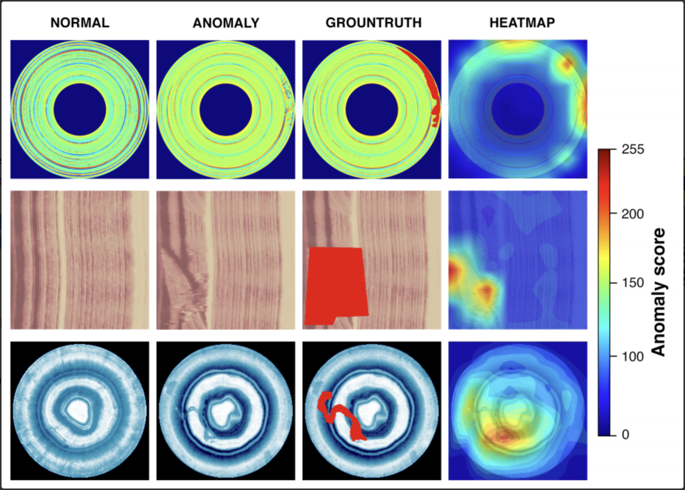

# Benchmark整理

## Catalogue

[toc]

## Datasets

### MVTec AD

​	MVTec AD is a dataset for benchmarking anomaly detection methods with a focus on industrial inspection. It contains over 5000 high-resolution images divided into fifteen different object and texture categories. Each category comprises a set of defect-free training images and a test set of images with various kinds of defects as well as images without defects.

​	The training set is only composed of  normal images, while the test set is a mixture of normal images and abnormal images

​	Defect Anomaly

### BTAD

​	BeanTech Anomaly Detection dataset (Mishraet al. 2021) has 3 categories industrial products with 2540 images.

​	The training set consists only of normal images, while the test set is a mixture of normal images and abnormal images.

​	pixel-wise

### MNIST / Fashion MNIST

* unimodal： 一个类作为正常样本，其他类作为异常样本
* multimodal case： 一个类作为异常样本，其他类作为正常

### CIFAR10/CIFAR100

* unimodal： 一个类作为正常样本，其他类作为异常样本
* multimodal case： 一个类作为异常样本，其他类作为正常

### DogsVsCats

​	The training archive contains 25,000 images of dogs and cats. Train your algorithm on these files and predict the labels for test1.zip (1 = dog, 0 = cat).

### ImageNet-30

​	Contain images from 30 classes of high resolution images chosen from the ImageNet dataset.

### KDDCUP

​	The KDDCUP99 10 percent dataset from the UCI repositor originally contains samples of 41 dimensions, where 34 of them are continuous and 7 are categorical. For categorical features, we further use one-hot representation to encode them, and eventually we obtain a dataset of 120 dimensions. As 20% of data samples are labeled as “normal” and the rest are labeled as “attack”, “normal” samples are in a minority group; therefore, “normal” ones are treated as anomalies in this task.

## SOTA methods

### Unsupervised

* **AnoGAN**. 	in   "Unsupervised Anomaly Detection with Generative Adversarial Networks to Guide Marker Discovery" 2017

  

* **F-AnoGAN**.    in  "f-AnoGAN: Fast unsupervised anomaly detection with generative adversarial networks" 2018

  

* **DAGMM**.    in    "Deep Autoencoding Gaussian Mixture Model for Unsupervised Anomaly Detection"  2018 ICLR

  

* **MemAE**.   in    "Memorizing Normality to Detect Anomaly: Memory-augmented Deep Autoencoder for Unsupervised Anomaly Detection" 2019 ICCV

  * MNIST: 0.9751 
  * CIFAR10: 0.6088

* **PaDiM**.    in    PaDiM: a Patch Distribution Modeling Framework for Anomaly Detection and Localization 2020
  * MVTec AD: 97.900(Detection AUROC); 97.500(Segmentation AUROC)
  
* **CFlOW-AD**.    in    "CFLOW-AD: Real-Time Unsupervised Anomaly Detection with Localization via Conditional Normalizing Flows" 2021
  * MVTec AD: 98.260(Detection AUROC); 98.620(Segmentation AUROC)
  
* **FastFlow**.    in    "FastFlow: Unsupervised Anomaly Detection and Localization via 2D Normalizing Flows" 2021
  
  * MVTec AD: 99.400(Detection AUROC); 98.500(Segmentation AUROC)
  * CIFAR10: 0.667
  
  > 2D解释：
  >
  > ​    论文中说是使用2D flow结构，然而在查看RealNVP论文源码之后，发现原始的Flow结构就是属于2D结构，故产生强调2DFlow结构的疑问。
  >
  > ​     后续调研发现，其对比方法是基于之前将Flow用到Anomaly Detection中的方法，例如DifferNet(2020)。在这些已有工作中，Flow结构采用FC结构，即1DFlow。究其原因是文章将Flow模块接到Representation网络之后做分布变换，而一般Representation提取网络输出都是特征向量（即1D向量），所以使用1DFlow是比较自然的做法。
  >
  > ​    回到FastFlow，文章提出需要保留图片局部特征结构，所以在特征提取阶段，并未使用最终1D特征向量，而是使用中间层具有2D结构的特征作为Flow的输入，从而可以使用2DFlow结构，即卷积操作。也就是原始的Flow结构。

### Surpervised

### Smi-supervised

