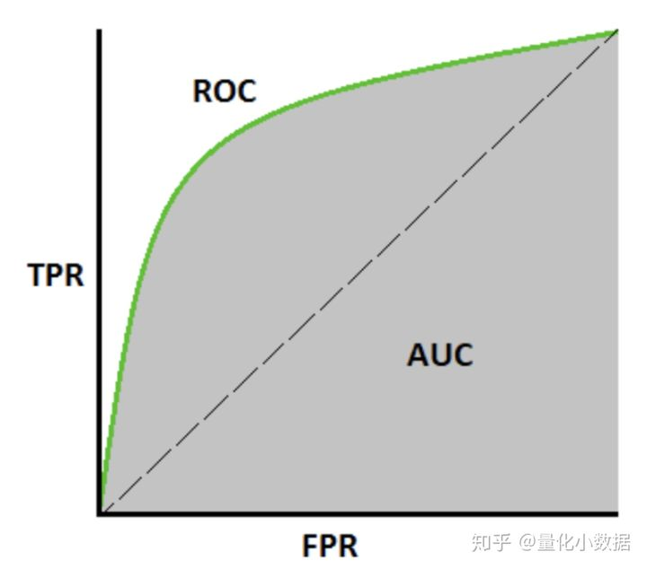

# Some Issues?

* The difference between AUC(AUROC) and ROC?

  * AUC: Area Under The Curve

  * ROC: Receiver Operating Characteristics

  * AUROC: Area Under the Receiver Operating Characteristics

  * Confusion matrix (混淆矩阵):

    |                  | Prediceted Class |                    |                    |
    | :--------------: | :--------------: | :----------------: | :----------------: |
    | **Actual Class** |                  |     Class=Ture     |    Class=False     |
    |                  |    Class=Ture    | True Positive(TP)  | False Negative(FN) |
    |                  |   Class=False    | Flase Positive(FP) | True Negative(TN)  |

    > Note: First letter means if the prediction is correct or not; Second letter means the predict result.

  * TPR (True Postive Rate, **Sensitivity** ):
    $$
    TPR = \frac{TP}{TP+FN}
    $$

    > Note: 分类器预测的正类中实际正实例占所有正实例的比例。

  * FPR（False Postive Rate）:
    $$
    FPR=\frac{FP}{FP+TN}
    $$

    > Note: 分类器预测的正类中实际负实例占所有负实例的比例。

  * TNR(Ture Negative Rate, **Specificity**):
    $$
    TNR = \frac{TN}{TN+FP}
    $$

    > Note: 分类器预测的负类中实际负实例占所有负实例的比例。

  * Recall and Precision
    $$
    Recall = TPR \\
    Precision = \frac{TP}{TP+FP} \\
    Accuracy(ACC) = \frac{TP+TN}{TP+TN+FN+FP} \\
    F-score = \frac{(a^2+1)Precision*Recall}{a^2(Precision+Recall)}
    $$

    > Note: 权重a可以调节Precision与Recall的比重，重要性程度。

  * ROC: Given some threshold, get a pairwise TPR and FPR, get a curve.

  

  * AUROC: Area Under the Receiver Operating Characteristics.

    

* How to compute image-level(Detection) and pixel-level(Segmentation) AUC?

  * Image-level

  * Pixel-level

    $p(x)$
    
    sliding window method

* Other data partition methods for regular dataset like MNIST/CIFAR10?

