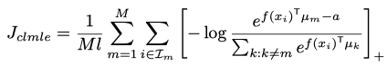

# Some Papers
## Representation-based
* D2C: Diffusion-Decoding Models for Few-Shot Conditional Generation, NIPS21

## Disentangle
* Self-Supervised Learning Disentangled Group Representation as Feature
* Self-Supervised Learning with Data Augmentations Provably Isolates Content from Style
* Joint-VAEß
* Factor-VAE
* $\beta$-TCVAE
## Others
* Deep Imbalanced Learning for Face Recognition and Attribute Prediction
  
* pass