# Toy example

## MNIST
### 网络结构
```
self.encoder = nn.Sequential(
                nn.Linear(784, self.hidden_size),
                nn.ReLU(),
                nn.Linear(self.hidden_size, self.hidden_size),
                nn.ReLU(),
                )
self.fc_mu = nn.Linear(self.hidden_size, self.latent_dim)
self.fc_var = nn.Linear(self.hidden_size, self.latent_dim)

self.reparameterize

self.decoder = nn.Sequential(
            nn.Linear(self.latent_dim, self.hidden_size),
            nn.ReLU(),
            nn.Linear(self.hidden_size, self.hidden_size),
            nn.ReLU(),
            nn.Linear(self.hidden_size, 784),
            nn.Sigmoid(),
            )
```
### 正常数据训练
> 60000 (55000/5000), balanced

recon
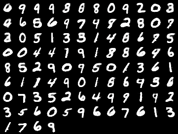
sample
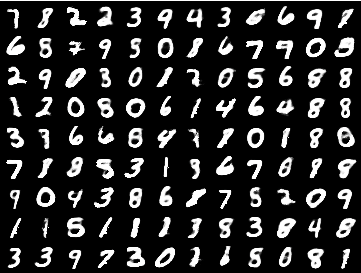

### 少量数据训练
> Two complete classes, balanced

recon
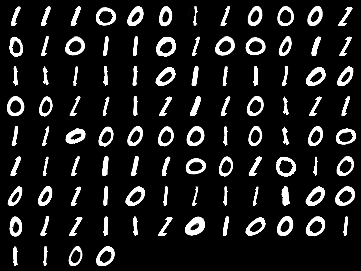
sample
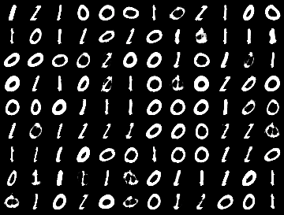

recon
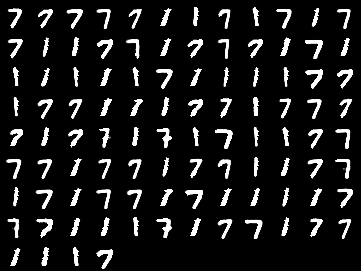
sample
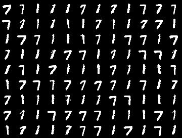

> One complete class

recon
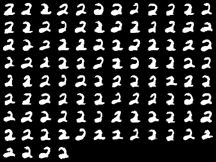
sample
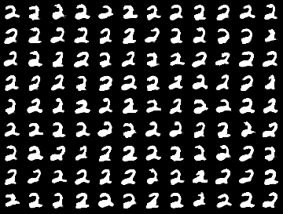

> One class with 100 samples

recon
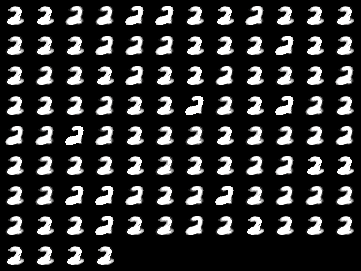
sample
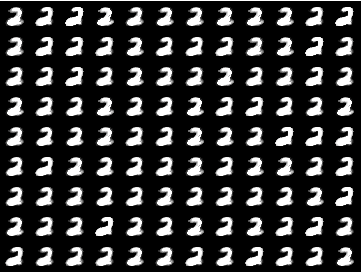

> One class with 50 samples

recon
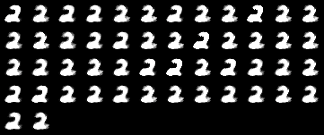
sample
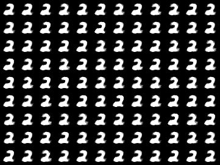

> One class with 5 samples

recon
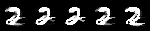
sample
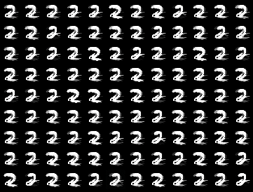


## Celeba
